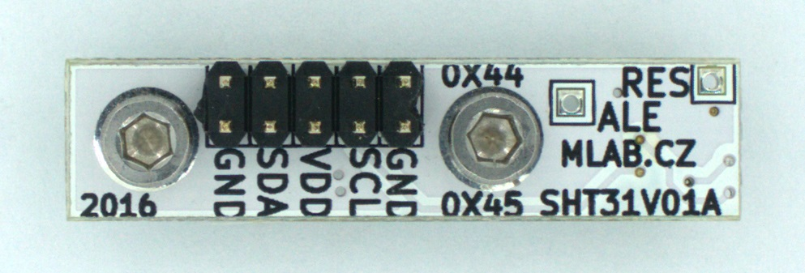

## SHT31V01 - Digital humidity and temperature sensor

The SHT31V01A MLAB module is a highly customizable and user-friendly module, designed for precise temperature and humidity measurements. The module is standardly equipped with the highly accurate SHT31 sensor from Sensirion, renowned for its reliability and resistance to interference.

The SHT31V01A module is designed to be compatible with other sensors from the SHT3x series, making it a universal solution for a wide range of applications, from home automation to industrial monitoring.

With the standard MLAB I2C pinout for communication, ALERT and Reset pins output to separate pins, and the option to change the I2C address by resoldering the setting resistor, this module offers maximum flexibility for integration into various systems and projects.

With the two mounting screws on the module, it can be easily and securely attached to the MLAB ALBASE board, making assembly and disassembly according to your needs easier.

### Specifications

- **Communication:** The module uses the I2C interface in the standard MLAB I2C pinout for data transfer. In addition, the ALERT and Reset pins are output to separate pins for easy handling.
- **Mounting:** There are two mounting screws on the module that allow easy mounting on the basic MLAB ALBASE board.
- **Configuration:** The module allows the I2C address to be changed by resoldering the setting resistor. This makes it easier to integrate the module into various systems with different I2C configurations.
- **Supply Voltage:** The module is designed for 3.3V power supply.
- **Measurement accuracy:** The module offers high measurement accuracy: ±0.2°C for temperature and ±2% relative humidity.
- **Operating ranges:** The operating range of temperatures is from -40°C to +125°C and humidity from 0 to 100% relative humidity.

### Usage

The SHT31V01A module can be used in many different applications that require temperature and humidity monitoring. This module can be beneficial in:

- **Weather Stations:** For monitoring and recording climate conditions.
- **Smart Homes:** For monitoring and regulating indoor temperature and humidity.
- **Horticulture and Agriculture:** For monitoring and regulating conditions for optimum plant growth.
- **Greenhouses and Terrariums:** To maintain strict climatic conditions.
- **Data Centers:** To monitor temperature and humidity for optimal server operation.

The use of the module is straightforward. Just mount it on the MLAB ALBASE board using the two mounting screws and connect it via the I2C interface. The I2C address of the module can be easily changed according to the needs of your project.

Thanks to the use of the I2C interface, it is very easy to connect this module to an Arduino or Raspberry Pi. You only need four wires: two for power supply (power and ground wire) and two for I2C communication (data and clock wire). I2C is beneficial in that it allows multiple devices to be connected to the same bus, saving GPIO pins on your microcontroller or single-board computer.

If you need to connect the module to a computer, you can use a USB to I2C adapter, such as the MLAB module [USBI2C01](https://github.com/mlab-modules/USBI2C01). This device allows you to communicate with the module via the USB port of your computer. This approach is particularly useful if you want to take advantage of the greater computational power of a computer or if you want to integrate the module into a system that is already running on a computer.

### Availability

The module is manufactured and sold by [Universal Scientific Technologies s.r.o.](www.ust.cz), which is the official manufacturer and seller of MLAB modules. The module is standardly produced with the SHT31, but other sensors from the SHT3x series can be fitted on request. For information on the availability and price of the module, write a request to info@ust.cz.

### SHT3x Series Sensors Comparison

| Sensor Model | Accuracy (Temp) | Accuracy (Humidity) |
| ------------ | --------------  | ------------------- |
| SHT30        | ±0.3°C          | ±3%                 |
| SHT31        | ±0.2°C          | ±2%                 |
| SHT35        | ±0.1°C          | ±1.5%               |

For more accurate comparision, check datasheet of SHT3x series. 
